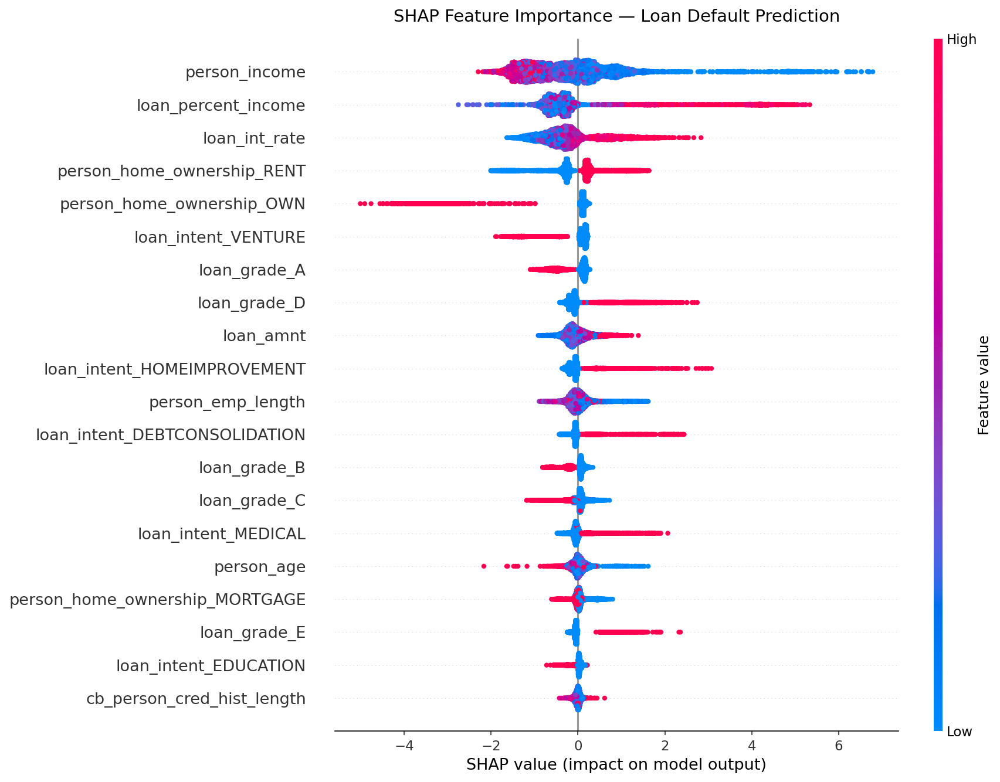

# Credit Risk Prediction with XGBoost

A machine learning pipeline that predicts whether a borrower will default on a loan, trained on a real-world credit risk dataset of 32,581 records.

## Results

| Metric | Score |
|---|---|
| Accuracy | **93.43%** |
| Precision (Default) | 0.96 |
| Recall (Default) | 0.73 |
| F1-Score (Default) | 0.83 |

## Project Structure

```
credit-risk-project/
│
├── credit_risk_dataset.csv      # Raw dataset (32,581 loan records, 12 features)
├── credit_risk_cleaned.csv      # Preprocessed dataset (nulls filled, one-hot encoded)
├── loan_model.json              # Saved XGBoost model
├── shap_summary.png             # SHAP feature importance beeswarm plot
│
├── preprocess.py                # Step 1 — Data cleaning & encoding
├── train_model.py               # Step 2 — Model training & evaluation
└── explain_model.py             # Step 3 — SHAP explainability
```

## Dataset Features

| Column | Description |
|---|---|
| `person_age` | Age of the applicant |
| `person_income` | Annual income (USD) |
| `person_home_ownership` | RENT / OWN / MORTGAGE / OTHER |
| `person_emp_length` | Years of employment |
| `loan_intent` | Purpose — PERSONAL, EDUCATION, MEDICAL, VENTURE, HOMEIMPROVEMENT, DEBTCONSOLIDATION |
| `loan_grade` | Lender-assigned risk grade (A = safest → G = riskiest) |
| `loan_amnt` | Loan amount requested (USD) |
| `loan_int_rate` | Annual interest rate (%) |
| `loan_percent_income` | Loan amount as a fraction of annual income |
| `cb_person_default_on_file` | Prior default on credit bureau record (Y/N) |
| `cb_person_cred_hist_length` | Length of credit history (years) |
| `loan_status` | **Target** — 0 = Paid, 1 = Default |

## Pipeline

### Step 1 — Preprocessing (`preprocess.py`)
- Loads the raw dataset
- Fills missing values with column medians (`person_emp_length`: 895 nulls, `loan_int_rate`: 3,116 nulls)
- One-hot encodes all categorical columns
- Exports `credit_risk_cleaned.csv`

### Step 2 — Model Training (`train_model.py`)
- 80/20 train-test split (`random_state=42`)
- Trains an `XGBClassifier` (200 estimators, depth 6, learning rate 0.1)
- Prints accuracy and full classification report
- Saves model to `loan_model.json`

### Step 3 — Explainability (`explain_model.py`)
- Loads model and reproduces the same test split
- Computes SHAP values with `shap.TreeExplainer`
- Generates a beeswarm summary plot saved as `shap_summary.png`

## SHAP Feature Importance



**Key findings from SHAP:**
- **`person_income`** is the strongest predictor — low income drives defaults most
- **`loan_percent_income`** (debt burden) is the second most impactful feature
- **`loan_int_rate`** — higher rates correlate with higher default risk
- **`loan_grade_A`** strongly reduces default probability, confirming the grading system works
- **Renters** (`person_home_ownership_RENT`) carry higher default risk than owners

## Requirements

```
xgboost
scikit-learn
pandas
shap
matplotlib
```

Install all dependencies:

```bash
pip install xgboost scikit-learn pandas shap matplotlib
```

## Usage

Run the three scripts in order:

```bash
python preprocess.py
python train_model.py
python explain_model.py
```
